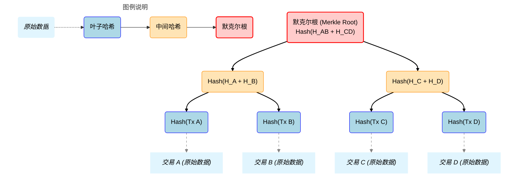

## 区块链简介

区块链是分布式系统：一组计算机网络，它们必须在不互相信任的情况下就共享数据达成一致。

### CAP定理

任何分布式系统最多只能保证以下三个属性中的两个：

- **一致性 (C)：所有服务器始终显示相同的数据。当服务器 A 上发生变化时，其他所有服务器会立即反映这一变化。**

- **可用性 (A)：即使服务器崩溃，系统也能继续工作。如果服务器 A 宕机，用户仍然可以通过服务器 B 和 C 访问账户。**

- **分区容错性 (P)：系统能够在网络故障将服务器分隔成孤立组时继续运行。**

我们必须保证分区容错性，因为网络分区是不可避免的：电缆会被切断，路由器会失效，数据中心会断电。这使我们需要在一致性和可用性之间做出选择。

传统银行系统通常选择一致性 + 分区容错性（CP 系统）。它们宁愿关闭系统也不愿显示错误的账户余额。

社交媒体平台通常选择可用性 + 分区容错性（AP 系统）。它们宁愿让你发布内容（即使朋友无法立即看到）也不愿完全阻止你发布。

### 拜占庭将军问题

除了 CAP 定理，大多数分布式系统假设参与者是诚实的：他们可能会失败或断开连接，但不会主动欺骗彼此。当参与者可能是恶意的时，这一假设就不成立了。

计算机科学家在 1982 年提出的拜占庭将军问题，说明了这一挑战：

你是一名拜占庭将军，计划攻打一座设防的城市。你有几位盟军将军分布在城市周围，每位将军指挥着自己的军队。为了成功，你必须协调同时发起攻击。如果有些人进攻而另一些人撤退，进攻的部队将被全歼。

你只能通过信使进行通信，而一些将军可能是叛徒，他们希望攻击失败。叛徒可能会：

- **向一些将军发送“进攻”消息，而向另一些将军发送“撤退”消息**

— **修改忠诚将军传递的消息**

- **与其他叛徒协调以最大化混乱**

当你无法区分忠诚的将军和叛徒，也无法信任通信渠道时，如何就“进攻”或“撤退”达成共识？

这似乎是不可能的。几十年来，计算机科学家认为无法构建一个同时具备以下特性的系统：

- **拜占庭容错（即使有恶意参与者也能正常工作）**

— **无许可（任何人都可以无需批准加入）**

- **去中心化（没有中央权威）**

然而在 2008 年，一个自称中本聪的人证明了他们是错的。

### 比特币：第一个区块链

比特币是区块链技术的第一个实际应用。虽然其各个组成部分（如加密哈希、数字签名、点对点网络）在此之前已经存在，但中本聪是第一个将它们结合起来，解决数字货币双重支付问题的人。

区块链，或称为“区块链条”，正如其在最初的比特币[白皮书](https://bitcoin.org/bitcoin.pdf)中所描述的那样，最终创建了一个同时具备分布式、拜占庭容错和无许可特性的系统。

这一突破并不是试图确定谁值得信任，而是让撒谎在经济上比说真话更昂贵。工作量证明通过要求参与者消耗真实的计算能量来提出更改实现了这一点。攻击者需要在电力上花费的成本超过他们通过攻击所能获得的收益。

## 密码学原语（Cryptographic Primitives）

区块链（Blockchain）的底层大厦是由多个**密码学原语（Cryptographic Primitives）**作为砖石构建而成的。简单来说，密码学决定了区块链的安全性、不可篡改性和去中心化信任的基础。

以下是区块链中最重要的几个核心密码学原语及其作用：

区块链（Blockchain）的底层大厦是由多个**密码学原语（Cryptographic Primitives）**作为砖石构建而成的。简单来说，密码学决定了区块链的安全性、不可篡改性和去中心化信任的基础。

以下是区块链中最重要的几个核心密码学原语及其作用：

### 1. 哈希函数 (Hash Function)

哈希函数是区块链的“灵魂”。它能将任意长度的输入映射为固定长度的输出（散列值）。

- **特性：**
  - **抗碰撞性：** 极难找到两个不同的输入产生相同的输出。
  - **不可逆性：** 无法从输出反推输入。
  - **雪崩效应：** 输入微小的改动会导致输出巨大的变化。
- **在区块链中的应用：**
  - **数据完整性：** 确保交易信息未被篡改。
  - **区块链接：** 每个区块都包含前一个区块的哈希值，形成链式结构。
  - **工作量证明 (PoW)：** 挖矿本质上就是在寻找符合特定条件的哈希值。

### 2. 非对称加密与数字签名 (Asymmetric Encryption & Digital Signature)

这是区块链解决“所有权”问题的核心。它使用一对密钥：**公钥 (Public Key)** 和 **私钥 (Private Key)**。

- **数字签名流程：**
  1. **签名：** 用户用自己的**私钥**对交易数据进行加密，生成签名。
  2. **验证：** 网络中的节点使用该用户的**公钥**验证签名。如果验证通过，说明该交易确实由私钥持有者发起。
- **在区块链中的应用：**
  - **身份认证：** 证明你是资产的所有者，而无需暴露私钥。
  - **地址生成：** 你的钱包地址通常是由公钥经过哈希运算得出的。

### 3. 默克尔树 (Merkle Tree)

默克尔树是一种哈希二叉树，用于高效地汇总和验证大规模数据。

- **原理：** 将大量交易两两分组进行哈希，层层向上，最终得到一个唯一的**根哈希 (Merkle Root)**。
- **在区块链中的应用：**
  - **轻节点验证：** 手机钱包等轻客户端不需要下载整个区块链，只需通过“默克尔路径”即可验证某笔交易是否存在。
  - **提高效率：** 大幅减少了在网络中传输和验证数据所需的带宽。

#### 图解说明：

1. **数据层 (最底部, 浅蓝色虚线框)：** 这里是实际发生的交易（Tx A, Tx B 等）。在区块链中，这些是区块体里的内容。
2. **叶子节点 (蓝色框)：** 首先，对每一个原始交易进行一次哈希运算，生成叶子节点哈希值（如 `Hash(Tx A)`）。
3. **中间节点 (橙色框)：** 接着，相邻的两个哈希值被连接（Concatenation）在一起，然后对连接后的结果再次进行哈希运算。例如，`Hash(Tx A)` 和 `Hash(Tx B)` 组合后进行哈希，生成了 `Hash(H_A + H_B)`。
4. **默克尔根 (顶部, 红色框)：** 这个过程不断向上重复，直到只剩下最后一个哈希值。这个值就是**默克尔根 (Merkle Root)**。

**关键点：** 如果最底部的任何一笔交易（例如 Tx A）发生了哪怕一个标点符号的改变，它的哈希 `H_A` 就会彻底改变，进而导致 `H_AB` 改变，最终导致顶部的**默克尔根**完全不同。这就是它能高效验证数据完整性的原因。

### 4. 同态加密与零知识证明 (Advanced Primitives)

为了在保护隐私的同时进行验证，现代区块链（如 Zcash、以太坊 2.0）引入了更高级的原语。

- **零知识证明 (Zero-Knowledge Proofs, ZKP)：** 证明者能在不向验证者提供任何有用信息的情况下，使验证者相信某个论断是正确的。
  - *例子：* 证明你有超过 100 个比特币，但不用展示你的余额或转账记录。
- **同态加密 (Homomorphic Encryption)：** 允许直接对加密数据进行运算，得到的结果解密后与对明文运算的结果一致。

### 总结对照表

| **密码学原语** | **主要解决的问题**     | **实际案例**           |
| -------------- | ---------------------- | ---------------------- |
| **哈希函数**   | 数据不可篡改、链式结构 | SHA-256 (比特币)       |
| **数字签名**   | 身份确认、资产所有权   | ECDSA (椭圆曲线签名)   |
| **默克尔树**   | 快速验证、节省空间     | 区块头中的 Merkle Root |
| **零知识证明** | 隐私保护、扩容验证     | zk-SNARKs              |

### 创建一个无需信任的系统

共识和加密原语共同作用，创建了一个“无需信任”的系统。历史上首次，信任被放在数学而非人身上：

- 哈希函数确保任何对历史数据的篡改都会立即显现。
- 数字签名在无需任何可信中介验证身份的情况下证明授权。
- 默克尔树使得无需下载大量数据即可验证复杂声明成为可能。

当结合共识机制时，这些工具创建了一个系统，每个参与者都可以仅使用自己的计算资源独立验证系统的整个历史记录。无需可信权威机构，无需共享秘密，也没有中心化的故障点。

这就是区块链代表如此根本性变革的原因。传统系统通过控制访问和限制参与来实现安全性。而区块链通过使验证变得廉价且普遍，同时使欺诈变得昂贵且显而易见来实现安全性。

理解这些基础要素至关重要，因为它们定义了区块链的能力和局限性。它们解释了为什么区块链交易是不可逆的（设计上使得逆转已完成交易的经济成本极高），为什么区块链系统可以在没有中心化权威的情况下运行（每个人都可以独立验证所有内容），以及为什么即使完全向公众开放参与，系统仍然保持安全。
